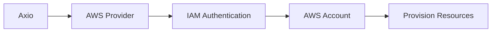

# Amazon Web Services (AWS)

Connect your AWS account to Axio to provision, manage, and monitor cloud infrastructure using Infrastructure-as-Code.

{: .highlight }

> ## AWS Integration
>
> Axio securely connects to your AWS account using IAM credentials, allowing projects and service catalogs to provision AWS resources while maintaining centralized governance and security.

---

## Architecture

---

# Prerequisites

Before connecting AWS, ensure that you have:

- An active AWS Account
- IAM User or IAM Role
- Access Key ID
- Secret Access Key
- Required IAM Permissions

{: .note }

> Use a dedicated IAM identity for Axio instead of personal AWS credentials.

---

# Step 1 — Create AWS Credentials

Create an IAM User or IAM Role with permissions required for infrastructure provisioning.

Typical permissions include:

- EC2
- VPC
- IAM
- S3
- EKS
- CloudWatch

---

# Step 2 — Navigate to Cloud Providers

Open **Cloud → Add Provider** inside Axio.

---

# Step 3 — Select Amazon Web Services

Choose **Amazon Web Services** from the provider list.

---

# Step 4 — Enter Credentials

Provide:

- Access Key ID
- Secret Access Key
- Default Region

{: .tip }

> Restrict IAM permissions using the principle of least privilege.

---

# Step 5 — Validate Connection

Axio verifies:

- Authentication
- Account Access
- IAM Permissions
- Region Availability

---

# Step 6 — Save Provider

Once validation succeeds, save the provider.

The AWS account becomes available for:

- Projects
- Service Catalog
- Infrastructure Templates
- Automation

---

## Best Practices

- Use IAM Roles whenever possible
- Rotate access keys regularly
- Restrict permissions
- Enable CloudTrail auditing
- Separate Production and Development accounts

{: .warning }

> Never expose AWS credentials in repositories or Terraform code.

---

## Next Steps

### Configure Microsoft Azure

Learn how to integrate Azure subscriptions with Axio.

[Microsoft Azure →](./azure/){: .btn .btn-primary }

