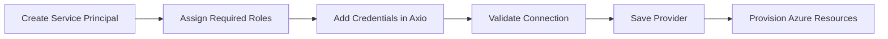

# Microsoft Azure

Connect your Microsoft Azure subscription to Axio and securely provision Azure infrastructure using standardized Infrastructure-as-Code workflows.

{: .highlight }

> ## Azure Integration
>
> Axio integrates with Microsoft Azure using **Service Principals**. Once connected, Azure subscriptions can be reused across Projects, Service Catalogs, Automation Pipelines, and Infrastructure Templates.

---

## Azure Integration Workflow

---

# Before You Begin

Ensure you have the following:

- Azure Subscription
- Azure Tenant ID
- Client ID
- Client Secret
- Subscription ID
- Contributor or Custom RBAC Role

{: .note }

> Create a dedicated Service Principal for Axio instead of using a personal Azure account.

---

### Step 1 — Create a Service Principal

Create a Service Principal using the Azure Portal or Azure CLI.

The Service Principal acts as the identity that Axio uses to provision and manage Azure resources.

---

### Step 2 — Assign Required Permissions

Grant the Service Principal the required role on your Azure Subscription.

Recommended roles include:

- Contributor
- Reader (Monitoring)
- Network Contributor (if required)

{: .tip }

> Follow the Principle of Least Privilege by assigning only the permissions required for infrastructure provisioning.

---

### Step 3 — Add Azure Provider

Navigate to:

**Cloud → Add Provider**

Choose **Microsoft Azure**.

---

### Step 4 — Configure Azure Credentials

Provide the following details:

- Tenant ID
- Subscription ID
- Client ID
- Client Secret

---

### Step 5 — Validate Connection

Axio validates:

- Azure Authentication
- Subscription Access
- Service Principal Permissions
- Azure API Connectivity

---

### Step 6 — Save the Provider

After validation completes successfully, save the provider.

The Azure subscription is now available for:

- Projects
- Service Catalog
- Infrastructure Templates
- Automation Workflows

---

## Best Practices

<h3>Dedicated Service Principal</h3>

Use a separate identity for infrastructure automation

<h3>Role-Based Access</h3>

Grant only the permissions required

<h3>Rotate Secrets</h3>

Update Client Secrets regularly

<h3>Separate Environments</h3>

Use different subscriptions for Development, Staging, and Production

---

{: .warning }

> Never store Azure Client Secrets inside Git repositories or Infrastructure-as-Code templates.

---

## Troubleshooting

| Issue | Resolution |
|--------|------------|
| Authentication Failed | Verify Tenant ID, Client ID, and Client Secret |
| Authorization Error | Ensure the Service Principal has the required RBAC role |
| Subscription Not Found | Verify the Subscription ID and associated permissions |
| Validation Failed | Check network connectivity and Azure API availability |
