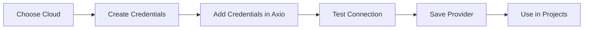

# Configure Cloud

Cloud Providers allow Axio to provision, manage, and monitor infrastructure securely across multiple cloud environments.

{: .highlight }

> ## Platform Overview
>
> Every infrastructure deployment begins with a configured cloud provider. Once connected, cloud accounts can be reused by Projects, Service Catalogs, and Infrastructure Templates.

---

## Configuration Workflow

---

# Before You Start

Prepare the following:

- Cloud account
- Administrative permissions
- Required API credentials
- Network connectivity
- Axio Project

{: .important }

> Store credentials securely and follow the principle of least privilege when granting permissions.

---

### Step 1 — Navigate to Cloud Providers

Open the **Cloud** section from the Axio navigation menu and select **Add Cloud Provider**.

From this page you can:

- View configured providers
- Add a new provider
- Edit existing providers
- Remove unused providers

---

### Step 2 — Select a Cloud Provider

Choose the cloud platform you want to integrate.

Supported providers include:

- Amazon Web Services
- Microsoft Azure
- Google Cloud Platform

---

### Step 3 — Configure Credentials

Provide the authentication details required by your selected cloud provider.

Examples include:

- IAM Access Keys
- Service Principals
- Service Account Keys

{: .tip }

> Avoid using personal credentials. Create dedicated service identities for automation whenever possible.

---

### Step 4 — Validate Connection

Axio verifies the supplied credentials before saving the configuration.

Validation includes:

- Authentication
- Permission checks
- API connectivity
- Account verification

---

### Step 5 — Register the Provider

After validation completes successfully, save the provider.

The configured provider can now be used by:

- Projects
- Service Catalog
- Infrastructure Templates
- Automation Pipelines

