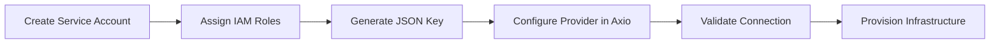

# Google Cloud Platform (GCP)

Connect your Google Cloud Platform (GCP) projects to Axio and securely provision cloud infrastructure using standardized Infrastructure-as-Code workflows.

{: .highlight }

> ## Google Cloud Integration
>
> Axio integrates with Google Cloud using **Service Accounts**. Once configured, GCP projects become available for Infrastructure Templates, Service Catalogs, Projects, and Automation Pipelines.

---

## Google Cloud Integration Workflow

---

# Before You Begin

Before connecting Google Cloud, ensure you have:

- A Google Cloud Project
- Billing Enabled
- Project ID
- Service Account
- Service Account JSON Key
- Required IAM Permissions

{: .note }

> Create a dedicated Service Account for Axio automation instead of using personal Google accounts.

---

### Step 1 — Create a Service Account

Navigate to:

**IAM & Admin → Service Accounts**

Create a new Service Account for Axio.

Provide:

- Service Account Name
- Description
- Project

---

### Step 2 — Assign IAM Roles

Grant the Service Account the permissions required for infrastructure provisioning.

Common roles include:

- Compute Admin
- Storage Admin
- Service Account User
- Kubernetes Engine Admin
- Viewer

{: .tip }

> Follow the Principle of Least Privilege by assigning only the permissions required for your infrastructure.

---

### Step 3 — Generate a JSON Key

Generate a Service Account Key.

Choose:

- JSON

Download the generated credentials securely.

{: .warning }

> Store the JSON key securely. Avoid committing it to Git repositories or sharing it with unauthorized users.

---

### Step 4 — Add Google Cloud Provider

Navigate to:

**Cloud → Add Provider**

Select **Google Cloud Platform**.

---

### Step 5 — Configure Provider Details

Provide:

- Project ID
- Service Account JSON Key
- Default Region (optional)

---

### Step 6 — Validate the Connection

Axio validates:

- Service Account Authentication
- Project Access
- IAM Permissions
- Google Cloud APIs

---

### Step 7 — Save the Provider

After successful validation, save the provider.

Your Google Cloud Project is now available for:

- Projects
- Infrastructure Templates
- Service Catalog
- Automation Workflows

---

## Troubleshooting

| Issue | Resolution |
|--------|------------|
| Authentication Failed | Verify the uploaded Service Account JSON Key |
| Permission Denied | Confirm the Service Account has the required IAM roles |
| Project Not Found | Validate the Project ID |
| API Disabled | Enable the required Google Cloud APIs |

---

{: .important }

> Protect Service Account JSON keys using a secure secrets management solution. Avoid storing credentials directly in repositories or infrastructure code.
