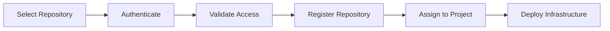

# VCS Connection

Version Control System (VCS) Connections allow Axio to access Infrastructure-as-Code repositories that define cloud resources, application infrastructure, and deployment configurations.

{: .highlight }

> ## Centralized Repository Management
>
> VCS Connections provide a single location to register and manage repositories used across multiple Axio projects.

---

## VCS Connection Workflow

---

# Before You Begin

Ensure that:

- A supported repository is available.
- Repository access has been granted.
- Authentication is configured.
- Projects have been created.

---

### Step 1 — Open VCS Connections

Navigate to:

**Settings → Integrations → VCS Connections**

---

### Step 2 — Create a Connection

Click **Add Connection**.

Provide:

- Connection Name
- Repository
- Branch
- Authentication Method

---

### Step 3 — Validate Repository Access

Axio verifies repository accessibility before registration.

Validation checks include:

- Authentication
- Repository permissions
- Branch availability

---

### Step 4 — Assign Projects

Select one or more projects that will use this repository.

---

### Step 5 — Repository Ready

The repository is now available for infrastructure deployments.

---

## Common Repository Usage

<h3>Infrastructure Code</h3>

Manage Terraform and IaC repositories

<h3>Shared Modules</h3>

Reuse infrastructure modules across projects

<h3>Team Collaboration</h3>

Maintain version-controlled infrastructure changes

<h3>Standardization</h3>

Use consistent repositories across environments

---

## Best Practices

- Use dedicated repositories for infrastructure.
- Protect default branches.
- Follow consistent repository structures.
- Review repository permissions periodically.

{: .warning }

> Avoid making infrastructure changes outside the registered repository to maintain consistency and traceability.
