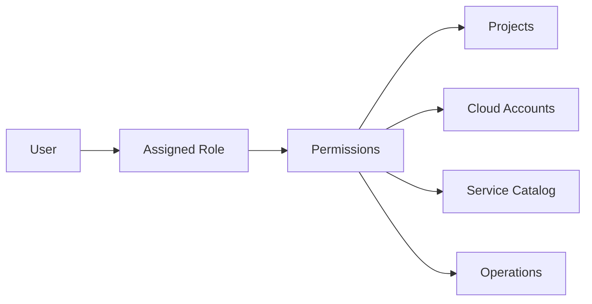

# Role-Based Access

Axio enables organizations to implement secure, scalable access control using Role-Based Access Control (RBAC). Instead of assigning permissions individually, administrators define roles and grant users access based on their responsibilities.

---

## Why RBAC?

As engineering teams grow, manually managing permissions becomes difficult and error-prone.

Role-Based Access helps organizations:

- Protect sensitive infrastructure
- Reduce permission sprawl
- Enforce least-privilege access
- Simplify user onboarding
- Improve governance

---

## How It Works

---

## Key Capabilities

### Role Management

Create predefined roles such as:

- Platform Administrator
- DevOps Engineer
- Developer
- Security Engineer
- Auditor
- Viewer

---

### Permission Control

Assign permissions for:

- Infrastructure provisioning
- Service Catalog
- Module Registry
- Policy Management
- Cloud Providers
- Operations

---

### Project Isolation

Restrict users to specific projects or environments.

Example:

- Production
- Development
- Testing

---

### Approval Workflows

Sensitive operations can require approvals before execution.

Examples:

- Production deployment
- IAM changes
- Infrastructure deletion

---

## Benefits

- Improved security
- Better governance
- Faster onboarding
- Consistent permission management
- Reduced operational risk

---

## Best Practices

-Follow least privilege
- Use predefined roles
- Review permissions regularly
- Separate production access

---

## Related Topics

- Policy & Compliance
- State Management
- Service Catalog

---

> Secure access control is the foundation of every modern Internal Developer Platform.
