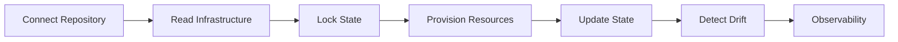

# State Management

Manage your infrastructure state securely from a centralized control plane. Axio stores, tracks, and protects infrastructure state throughout the complete deployment lifecycle, enabling reliable Infrastructure-as-Code operations across teams.

{: .highlight }
> ## Platform Overview
>
> State Management acts as the **single source of truth** for your infrastructure.
> Every deployment updates the infrastructure state, allowing Axio to safely coordinate provisioning, detect configuration drift, and maintain deployment history.

---

## State Management Workflow

---

# Before You Begin

Ensure you have completed the following:

- Git repository connected
- Cloud provider configured
- Terraform modules available
- Required credentials added
- Appropriate project permissions

{: .note }

> Infrastructure state should always be stored remotely.
> Shared state enables collaboration, versioning, and safe deployments.

---

### Step 1 — Connect Your Repository

Connect the Git repository that contains your Infrastructure-as-Code project.

During repository discovery Axio will:

- Detect Terraform projects
- Read module structure
- Validate repository configuration
- Prepare infrastructure metadata

---

### Step 2 — Configure Remote State

Choose where your infrastructure state will be stored.

Supported remote backends include:

- AWS S3
- Azure Storage
- Google Cloud Storage
- Terraform Cloud
- Axio Managed Backend

{: .important }

> Never store production Terraform state locally.
> Remote state enables secure collaboration and automatic locking.

---

### Step 3 — Lock Infrastructure State

Before provisioning begins, Axio automatically acquires a state lock.

State locking prevents:

- Concurrent deployments
- State corruption
- Race conditions
- Manual conflicts

---

### Step 4 — Provision Infrastructure

After validation completes, infrastructure changes are executed.

Axio continuously tracks:

- Current execution
- Provisioning logs
- Resource creation
- Failed operations

---

### Step 5 — Update Infrastructure State

When deployment succeeds, Axio updates the latest infrastructure state.

Each deployment automatically records:

- State version
- Deployment ID
- Timestamp
- Triggered by
- Infrastructure changes

{: .tip }

> Every state update is versioned, making rollback and auditing significantly easier.

---

### Step 6 — Detect Configuration Drift

Axio continuously compares the desired infrastructure with the actual cloud environment.

Drift detection helps identify:

- Manual cloud changes
- Missing resources
- Unexpected modifications
- Infrastructure inconsistencies
