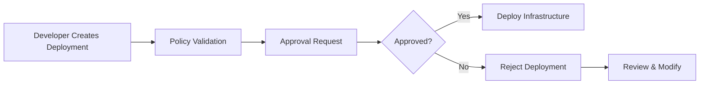

# Approvals

Approval Workflows help organizations enforce governance before infrastructure changes are applied. By introducing approval gates, Axio ensures that sensitive deployments are reviewed by the appropriate stakeholders before execution.

{: .highlight }

> ## Why Approval Workflows?
>
> Production infrastructure often requires additional oversight. Approval workflows ensure deployments follow organizational policies while reducing operational risks.

---

## Approval Workflow

---

# Before You Begin

Before creating approval workflows:

- Projects should be configured
- Roles and permissions should be assigned
- Cloud providers should be connected
- Policies should already exist

{: .note }

> Approval workflows are typically used for Production environments or high-impact infrastructure changes.

---

### Step 1 — Navigate to Approval Management

Open:

**Security & Governance → Approvals**

Here you can:

- View Approval Rules
- Create Approval Policies
- Review Pending Requests
- View Approval History

---

### Step 2 — Create an Approval Policy

Click **Create Approval Workflow**.

Configure:

- Workflow Name
- Description
- Target Environment
- Required Approvers

---

### Step 3 — Configure Approval Rules

Choose when approvals are required.

Examples include:

- Production deployments
- Infrastructure deletion
- IAM changes
- Network modifications
- Cost threshold exceeded

{: .tip }

> Keep approval rules simple and focused. Separate production approval policies from development workflows.

---

### Step 4 — Assign Approvers

Select one or more approvers.

Supported approver types:

- Platform Administrators
- Team Leads
- Security Teams
- Project Owners

---

### Step 5 — Review Approval Requests

Whenever a deployment matches an approval rule, Axio creates a pending approval request.

Approvers can:

- Review Infrastructure Changes
- Approve
- Reject
- Add Comments

---

### Step 6 — Deployment Execution

Once approved, the deployment continues automatically.

---

## Approval Levels

<h3>Single Approval</h3>

One authorized user approves the deployment

<h3>Multi-Level Approval</h3>

Multiple approvers review before deployment

<h3>Environment-Based</h3>

Require approvals only for selected environments

<h3>Emergency Override</h3>

Allow temporary administrative approval when required

---

## Best Practices

- Use approvals only where necessary
- Separate Development and Production workflows
- Keep approval history for auditing
- Notify stakeholders automatically
- Review approval rules periodically

{: .warning }

> Avoid requiring approvals for every deployment. Excessive approval gates can slow delivery and reduce developer productivity.
