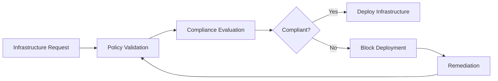

# Compliance

Compliance ensures that your infrastructure continuously adheres to organizational policies, security standards, and governance requirements throughout its lifecycle.

With Axio, compliance validation is integrated into every deployment, helping platform teams detect violations before infrastructure reaches production.

{: .highlight }

> ## Continuous Compliance
>
> Compliance is not a one-time activity. Axio continuously validates infrastructure against approved organizational policies during provisioning and operational lifecycle management.

---

## Compliance Workflow

---

# Before You Begin

Before enabling compliance validation, ensure:

- Governance policies are configured
- Cloud providers are connected
- Projects are onboarded
- Approval workflows are available (optional)

{: .note }

> Compliance validation automatically runs before infrastructure provisioning and can also be executed periodically to ensure ongoing compliance.

---

### Step 1 — Open Compliance Dashboard

Navigate to:

**Security & Governance → Compliance**

The dashboard provides:

- Compliance Status
- Active Policy Evaluations
- Failed Resources
- Recent Compliance Reports
- Historical Trends

---

### Step 2 — Select a Project

Choose the project or environment you want to evaluate.

Compliance checks can be performed for:

- Development
- Testing
- Staging
- Production

---

### Step 3 — Execute Compliance Validation

Run a compliance evaluation against the selected infrastructure.

Axio evaluates:

- Infrastructure Templates
- Cloud Configurations
- Security Policies
- Governance Rules
- Deployment Standards

{: .tip }

> Schedule recurring compliance scans to detect configuration changes introduced after deployment.

---

### Step 4 — Review Compliance Report

After validation completes, Axio generates a detailed compliance report.

The report includes:

- Passed Checks
- Failed Checks
- Severity Levels
- Resource Details
- Recommended Actions

---

### Step 5 — Review Violations

Every failed validation includes detailed remediation guidance.

Typical violations include:

- Missing resource tags
- Publicly exposed resources
- Unencrypted storage
- Unsupported regions
- Naming convention failures

---

### Step 6 — Remediate and Revalidate

After resolving identified issues, rerun compliance validation to confirm that all violations have been addressed.

---

## Compliance Categories

<h3>Security</h3>

Validate encryption, networking, and identity configurations

<h3>Governance</h3>

Ensure infrastructure follows organizational standards

<h3>Operational</h3>

Verify deployment consistency and lifecycle controls

<h3>Cost</h3>

Detect oversized resources and inefficient infrastructure

---

## Compliance Reports

Compliance reports provide visibility into infrastructure health across projects.

Each report includes:

- Evaluation Summary
- Total Checks
- Passed Checks
- Failed Checks
- Severity Distribution
- Evaluation Timestamp
- Auditor Information

---

{: .warning }

> Compliance validation should complement organizational security processes. Regular policy reviews and remediation workflows help maintain a secure and compliant infrastructure.
