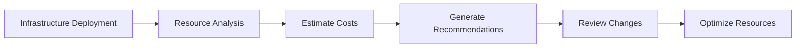

# Cost Optimization

Cloud infrastructure should be both reliable and cost-efficient. Axio provides centralized visibility into infrastructure usage, helping organizations identify optimization opportunities and reduce unnecessary cloud spending.

{: .highlight }

> ## Cost Visibility
>
> Axio helps platform teams understand infrastructure costs before and after deployments, enabling informed decisions without compromising governance or operational reliability.

---

## Cost Optimization Workflow

---

# Before You Begin

Ensure that:

- A cloud provider is configured
- Infrastructure has been provisioned
- Projects are onboarded
- Cost reporting is enabled

---

### Step 1 — Open Cost Dashboard

Navigate to:

**Security & Governance → Cost Optimization**

The dashboard displays:

- Estimated Monthly Cost
- Active Resources
- Cost Trends
- Optimization Opportunities

---

### Step 2 — Select a Project

Choose the infrastructure project you want to analyze.

---

### Step 3 — Analyze Infrastructure

Axio reviews deployed resources and evaluates:

- Compute
- Storage
- Networking
- Kubernetes Clusters
- Databases

---

### Step 4 — Review Cost Recommendations

Optimization suggestions may include:

- Rightsize virtual machines
- Remove idle resources
- Reduce storage usage
- Delete unused load balancers
- Consolidate infrastructure

{: .tip }

> Review recommendations carefully before applying them to production environments.

---

### Step 5 — Track Cost Trends

Monitor spending across projects and environments.

---

## Best Practices

- Review cost reports regularly
- Remove unused resources
- Monitor long-running workloads
- Use standardized infrastructure templates
- Plan capacity based on actual usage

{: .warning }

> Cost optimization recommendations should be evaluated alongside performance and availability requirements before implementation.

---

## What's Next?

Congratulations! 

You have completed the **Security & Governance** documentation.

Continue with the **Integrations** section to connect external systems such as GitHub, GitLab, Azure DevOps, Bitbucket, and OAuth providers with Axio.

### Continue to Integrations

Learn how to connect repositories, version control systems, and identity providers to Axio.
