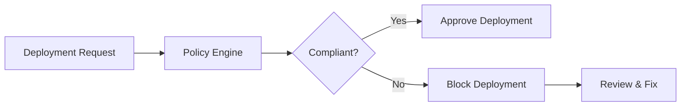

# Policies

Policies define the governance rules that every infrastructure deployment must follow.

With Axio, platform teams can create and enforce policies that validate infrastructure before resources are provisioned, ensuring deployments remain secure, compliant, and consistent.

{: .highlight }

> ## Policy Enforcement
>
> Every deployment request is evaluated against organizational policies before infrastructure changes are applied. This helps prevent misconfigurations and ensures standardized deployments across environments.

---

## Policy Evaluation Workflow

---

# Before You Begin

Before creating policies, ensure that:

- Projects are configured
- Cloud providers are connected
- Infrastructure templates are available
- Required user permissions are assigned

{: .note }

> Policies should be reusable across multiple projects to maintain consistency throughout the organization.

---

### Step 1 — Navigate to Policy Management

Open the **Security & Governance** section and select **Policies**.

From here you can:

- View existing policies
- Create new policies
- Update governance rules
- Review policy status

---

### Step 2 — Create a Policy

Select **Create Policy** and provide:

- Policy Name
- Description
- Category
- Scope
- Enforcement Mode

---

### Step 3 — Define Policy Rules

Configure the validation rules that infrastructure must satisfy.

Examples include:

- Required resource tags
- Approved cloud regions
- Encryption enabled
- Naming conventions
- Resource limits

{: .tip }

> Keep policies modular and reusable. Instead of one large policy, create smaller policies for networking, security, tagging, and cost governance.

---

### Step 4 — Assign Policy Scope

Policies can be applied to:

- Projects
- Teams
- Environments
- Infrastructure Templates

---

### Step 5 — Validate Deployments

Every infrastructure deployment is automatically evaluated before execution.

If a deployment violates any configured policy, Axio blocks the request and provides validation feedback.

---

## Best Practices

- Define reusable policies
- Apply policies consistently across environments
- Test policies before production rollout
- Review policy violations regularly
- Maintain policy version history

{: .warning }

> Overly restrictive policies may unintentionally block valid deployments. Review and test policy logic before enabling enforcement.
